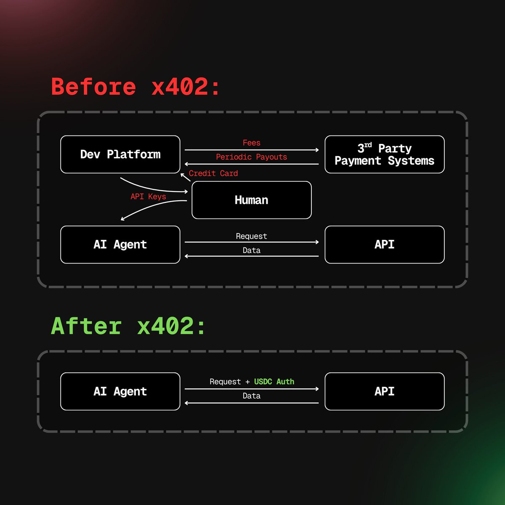
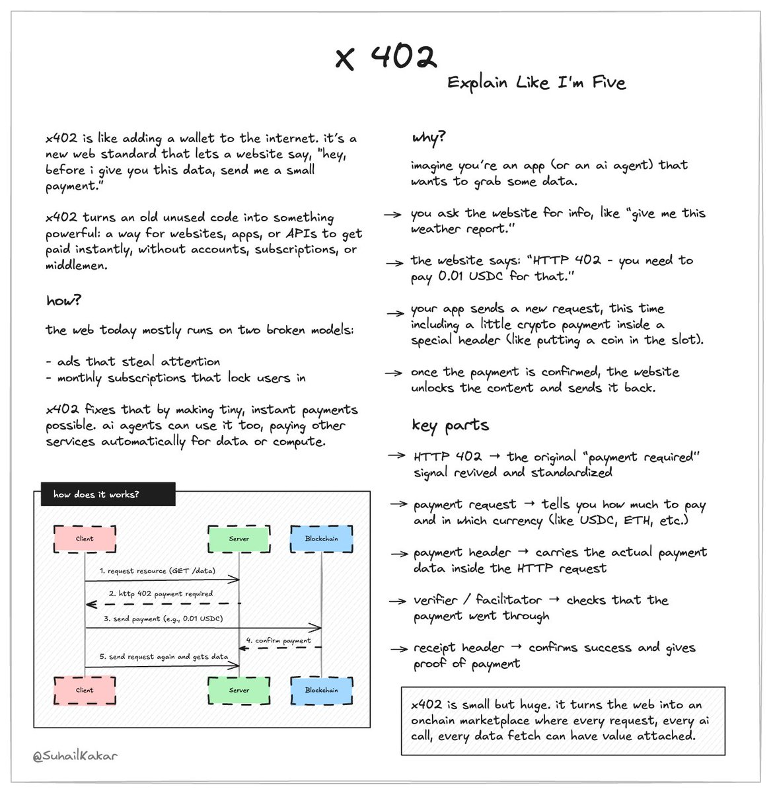

# x402 Resources

Everything you need to know about x402 - the protocol that finally makes HTTP 402 useful after 28 years.

## What is x402?

x402 is a protocol for pay-per-call API access using crypto. Remember HTTP 402 "Payment Required"? That error code has existed since 1997 but never actually did anything. x402 finally makes it work.

### The basics

**x402** = Pay per API call
- Hit an API, pay only for that call
- No subscriptions, no API keys, no account signup
- Payment happens in the HTTP request itself

**ERC-8004** = On-chain directory of AI agents
- Think of it like a phone book for AI agents on the blockchain
- Each agent has its own wallet
- Makes it possible for agents to find and pay each other

**Why both?** x402 handles the payment mechanics over HTTP. ERC-8004 helps you discover which agents to pay.

---

## The Problem x402 Solves

### How API access works today (spoiler: it sucks)

Want to use an API? Here's what you have to do:
- Create an account
- Verify your email
- Add credit card + billing address
- Get stuck in a subscription you don't need
- Manage API keys
- Do this entire dance again when you switch providers

HTTP 402 has been sitting there since 1997 saying "Payment Required" with no actual way to pay. Kind of useless.

### What x402 changes

- Pay per call, that's it
- No accounts, no subscriptions
- No API keys to manage
- Switch providers instantly
- Works great for autonomous AI agents
- Bonus: built-in spam protection (if it costs money to spam, people won't)

---

## How x402 Works

It's built on **thirdweb Nexus** - a hosted proxy that makes the 402 status code actually work on any API.

### If you're building an API

1. Set your prices for different routes
2. Configure auth rules (if you need them)
3. Deploy it (usually no code changes needed)

### If you're using an API (or building an agent)

1. Find APIs through registries
2. Send your HTTP request with payment attached
3. Done

The big deal here is that AI agents can now access the entire internet without a human having to create accounts or manage keys for them.

---

## Related Standards

- **x402** - Pay-per-call API protocol
- **ERC-8004** - AI agent registry standard
- **ERC-8041** - Related Ethereum standard
- **ERC-3009** - Transfer with authorization

---

## Visual Guides

*Visual explanation of the x402 protocol architecture*

---

## Official Documentation

- [Coinbase x402 Product Page](https://www.coinbase.com/en-in/developer-platform/products/x402)
- [Coinbase x402 Launch Announcement](https://www.coinbase.com/en-in/developer-platform/discover/launches/x402)
- [Solana x402 Overview](https://solana.com/x402/what-is-x402)
- [Intro to x402 - Developer Guide](https://solana.com/developers/guides/getstarted/intro-to-x402)
- [x402 Official Website](https://x402.org/)

---

## Use Cases

What can you actually do with this? Turns out, a lot:

**Digital stuff**
- Event tickets, cloud storage, domain names
- Hosting services, data transfers

**Software & APIs**
- Pay-per-call API access (obviously)
- Software licenses, in-app purchases
- Premium features

**Business things**
- One-time payments, recurring billing
- Freelance payments, streaming subscriptions

**E-commerce**
- Online checkout, reservation deposits
- Hardware upgrades

Basically anywhere you need to charge for something, especially in small amounts or per-use.

---

## Real-World Examples

### Someone built 5 AI agents in a week

A developer made 5 AI agents in 7 days that:
- Earn USDC
- Pay for services on BASE
- Run 24/7 without human intervention

The agents:
- Bridge aggregator
- MEV detector
- Contract scanner
- Whale tracker
- P&L calculator

The interesting part: regular apps need a human to approve transactions. These agents just... do it themselves.

---

## Hackathons

Want to build something with x402? There's a hackathon:
- [Solana x402 Hackathon](https://solana.com/x402/hackathon)

---

## Code Examples & Demos

### Official repos

- [Coinbase x402 - Main Repository](https://github.com/coinbase/x402)
- [x402 PR #542 - Notable Implementation](https://github.com/coinbase/x402/pull/542)

### Community projects

- [Vend - Payment Gateway](https://github.com/usmaneth/Vend/)
- [x402 Vending Machine](https://github.com/heurist-network/x402-vending-machine)
- [x402 Gated API](https://github.com/jarrodwatts/x402-gated-api)
- [x402 Sovereign Implementation](https://github.com/Dhaiwat10/x402-sovereign)
- [x402 Solana Examples](https://github.com/Woody4618/x402-solana-examples)
- [Eliza OS MCP Gateway](https://github.com/elizaOS/mcp-gateway/tree/main)
- [Lucid Agents by Daydreams AI](https://github.com/daydreamsai/lucid-agents)

### Live demos

- [x402 Demo by AnySpend](https://x402-demo.anyspend.com/)
- [OpenX402 Demo](https://x.com/openx402/status/1985764649971978252)

---

## Educational Resources

### Videos

- [x402 Explained - Comprehensive Guide](https://www.youtube.com/watch?v=Dg5IplJ1mng)
- [Building with x402 - Tutorial](https://www.youtube.com/watch?v=iaIxRxvp9Vk)
- [Dabit3's x402 Demo](https://x.com/dabit3/status/1982658854346494042)
- [Finematics on x402](https://x.com/finematics/status/1982810231512994014)
- [x402 Implementation Guide](https://x.com/akashneelesh/status/1985633919329583402)

### Articles and threads

- [Suhail Kakar's x402 Overview](https://x.com/SuhailKakar/status/1982787779772768261)
- [Dhaiwat's x402 Implementation](https://x.com/dhaiwat10/status/1984325028687855981)
- [Jarrod Watts' x402 Tutorial](https://x.com/jarrodWattsDev/status/1983075160178696665)
- [Ben Hummuson x402 Guide](https://x.com/hummusonrails/status/1983115447689257164)
- [Chris Kim's x402 Demo](https://x.com/chriskim_dev/status/1983200236530217298)
- [Nader Dabit's x402 Introduction](https://x.com/dabit3/status/1981777610142367958)

---

## Community Articles

### Deep dives

- [Agentic Commerce: Why x402 is Just the Beginning - LongHash VC](https://www.longhash.vc/post/agentic-commerce-why-x402-is-just-the-beginning)

### More community takes

- [YQ on x402 Architecture](https://x.com/yq_acc/status/1983260307251479024)
- [YQ on ERC-8004](https://x.com/yq_acc/status/1985302546349425147)
- [Jarrod Watts' x402 Thoughts](https://x.com/jarrodwatts/status/1982036553481568512)
- [Jarrod Watts on Agent Economy](https://x.com/jarrodwatts/status/1986406098681893096)
- [Abruzuc's x402 Analysis Part 1](https://x.com/abruzuc/status/1983229012122988830)
- [Abruzuc's x402 Analysis Part 2](https://x.com/abruzuc/status/1986861150055899383)
- [Abruzuc's x402 Analysis Part 3](https://x.com/abruzuc/status/1985753258795942366)
- [Yash on x402 Implementation](https://x.com/yashhsm/status/1985232040908685526)
- [YashasEdu's x402 Tutorial](https://x.com/YashasEdu/status/1985635276514082963)
- [13yearoldvc on x402](https://x.com/13yearoldvc/status/1983950251359924337)
- [Dhaiwat's x402 Guide](https://x.com/dhaiwat10/status/1981933653824540689)
- [Dhaiwat on x402 Architecture](https://x.com/dhaiwat10/status/1982057476494131300)
- [Jinglingcookies' x402 Thread](https://x.com/jinglingcookies/status/1980273307997049228)
- [Howdy Merry's x402 Analysis](https://x.com/howdymerry/status/1982541964647252405)
- [Genius Yinka on x402](https://x.com/geniusyinka/status/1982866070663827723)
- [JSKuros' x402 Perspective](https://x.com/jskuros/status/1983303575590801472)
- [S4mmyEth on x402](https://x.com/S4mmyEth/status/1981672515844878508)
- [Dan Kim's x402 Analysis](https://x.com/dankimxyz/status/1985784469895463148)
- [Miles Deutscher on x402](https://x.com/milesdeutscher/status/1985465142881202660)
- [ELI5 DeFi - x402 Explained Part 1](https://x.com/eli5_defi/status/1985346332706709923)
- [ELI5 DeFi - x402 Explained Part 2](https://x.com/eli5_defi/status/1983467514001813704)

---

## Tools & Infrastructure

### Useful platforms

- [x402.org](https://x402.org/) - Main hub
- [x402 Secure](https://www.x402secure.com/) - Security tools
- [x402 Scan](https://www.x402scan.com/) - Explorer
- [x402 Chat](https://x402.chat/) - Community chat
- [ERC-8004 Analytics on Dune](https://dune.com/hashed_official/erc8004) - On-chain data

---

## License

This is just a community resource list. Individual projects have their own licenses.

## Contributing to This Repo

Found a broken link? Want to add something? PRs welcome.
